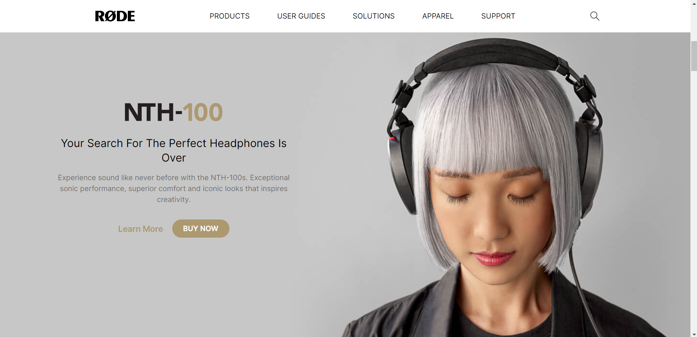
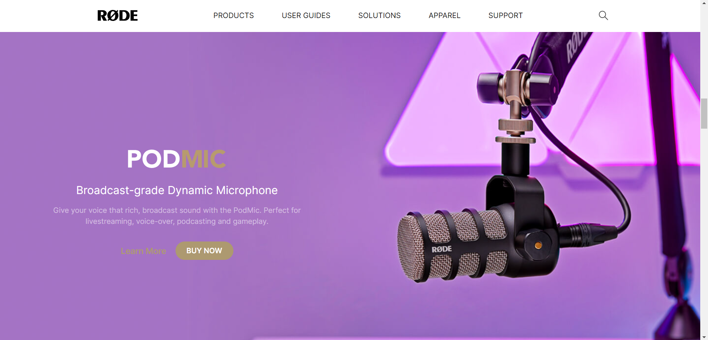
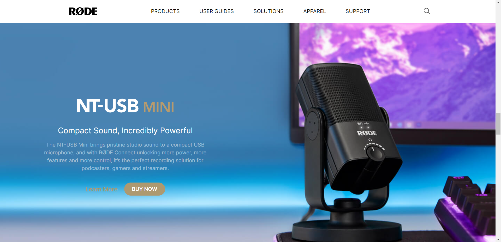

# Rode Clone

This is clone of [rode](https://rode.com/en) website 

## 🛠 Technologies Used
- HTML
- tailwind CSS 

## 💻Demo Link 

 you can view this project [rode clone](https://harshadbirajdar.github.io/rode-clone/)

## ⏲️Time to finish the project

 I had took about 4hrs to complete this project.

## What i learn in this project

-   Apply background image with differnet screen size

## Screen shot

